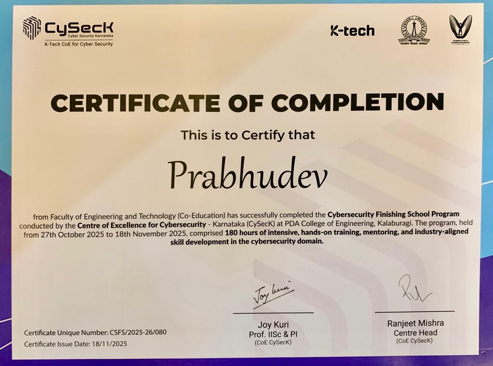

# 📜 CySecK Certification

## Government of Karnataka – Cybersecurity Finishing School

This section contains my official certification awarded upon successful completion of the Government of Karnataka's **CySecK Cybersecurity Finishing School Program**.

### Program Overview

- Duration: **180 Hours**
- Mode: Hands-on Industry Training
- Domain: Cybersecurity
- Organized by: CySecK (K-Tech Centre of Excellence for Cyber Security)
- Mentorship: Cybersecurity Entrepreneurs & Industry Professionals

---

## Certificate Preview

---

