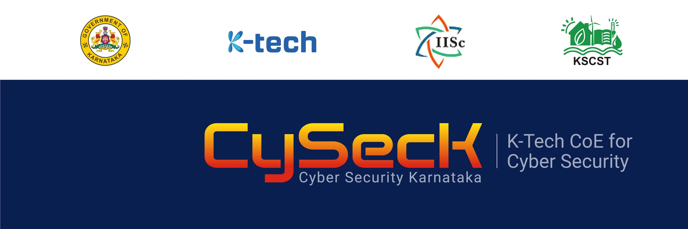

  

# 🛡️ Cybersecurity Portfolio – CySecK Cybersecurity Finishing School

> **A practical cybersecurity portfolio demonstrating hands-on experience in digital forensics, web application security, penetration testing, Capture The Flag (CTF) competitions, and industry engagement through the Government of Karnataka's CySecK Cybersecurity Finishing School.**

---

## 👋 About Me

I'm **Prabhudev Mathpati**, a final-year **B.Tech Artificial Intelligence & Data Science** student passionate about **Cybersecurity**, **Offensive Security**, **Digital Forensics**, and **Web Application Security**.

I believe the best way to demonstrate technical ability is through **proof of work**. This repository documents my practical learning journey through real laboratory exercises, technical assessments, machine write-ups, Capture The Flag competitions, and industry events completed during the **180-hour CySecK Cybersecurity Finishing School**.

---

# 🎯 About CySecK

The **CySecK Cybersecurity Finishing School** is a Government of Karnataka initiative designed to bridge the gap between academic learning and industry-ready cybersecurity skills through intensive hands-on training, practical laboratories, Capture The Flag competitions, industry mentorship, and technical conferences.

Throughout the program, I worked under the guidance of cybersecurity entrepreneurs and industry professionals, gaining practical experience in:

- Offensive Security
- Digital Forensics
- Network Security
- Web Application Security
- Malware & Mobile Security
- Vulnerability Assessment & Penetration Testing (VAPT)
- Incident Investigation
- Capture The Flag (CTF)

---

# 🚀 Repository Highlights

✔ Government of Karnataka Cybersecurity Finishing School (180 Hours)

✔ Hands-on experience with 25+ industry-standard cybersecurity tools

✔ Digital Forensics investigations and assessment reports

✔ Web Application Security assessments using DVWA, Burp Suite, and OWASP methodologies

✔ Penetration testing machine write-ups

✔ Multiple Capture The Flag (CTF) competitions

✔ Participation in the IISc Bengaluru Annual Cybersecurity Conference

✔ Industry exposure at Bengaluru Tech Summit 2025

✔ Technical documentation, practical reports, and supporting evidence

---

# 📂 Repository Structure

| Section | Description |
|---------|-------------|
| 📜 Certification | Official CySecK completion certificate and program credentials |
| 🎯 Program Overview | Overview of the CySecK program, objectives, mentors, and curriculum |
| 🛡️ Technical Training | Core cybersecurity domains, methodologies, and tools explored |
| 🕵️ Digital Forensics Reports | Practical forensic investigations, tools, and assessment reports |
| 🌐 Web Application Security | OWASP Top 10, Burp Suite, DVWA, and security assessments |
| 💻 Machine Write-ups | Practical penetration testing lab write-ups and methodologies |
| 🏆 Capture The Flag | Competition experience, challenge categories, and technical highlights |
| 🚀 Bengaluru Tech Summit 2025 | Industry exposure, startup interactions, and technology showcase |
| 🏛️ IISc Bengaluru | Annual cybersecurity conference, CTF participation, and professional networking |
| 📸 Gallery | Photographs documenting training, competitions, conferences, and events |
| 📬 Contact | Professional contact information |

---

# 🛠 Technical Skills Demonstrated

### Cybersecurity

- Ethical Hacking
- Vulnerability Assessment & Penetration Testing (VAPT)
- Digital Forensics
- Network Security
- Web Application Security
- Incident Investigation
- OSINT
- Malware Analysis

### Industry Tools

Burp Suite • Wireshark • Nmap • Metasploit • Gobuster • Nikto • Scapy • FTK Imager • Autopsy • HxD • MobSF • Genymotion • Hydra • SQLMap • Steghide • ExifTool • Bulk Extractor • John the Ripper

---

# 📑 Documentation Philosophy

Every practical exercise in this repository follows a structured approach:

- Objective
- Methodology
- Tools Used
- Practical Implementation
- Observations
- Learning Outcome

I believe **technical work should be reproducible, well-documented, and supported by evidence**, not simply listed on a résumé.

---

# 📸 Evidence Included

Throughout the repository you'll find:

- Practical assessment reports
- Investigation reports
- Machine write-ups
- Laboratory screenshots
- Competition photographs
- Event photographs
- Conference participation
- Technical documentation
- Certificates

Each section contains its own README, supporting reports, and relevant images to provide a complete view of the work performed.

---

# 👀 Recommended Reading Order

To follow the complete learning journey, explore the repository in the following order:

1. 📜 Certification
2. 🎯 Program Overview
3. 🛡️ Technical Training
4. 🕵️ Digital Forensics Reports
5. 🌐 Web Application Security
6. 💻 Machine Write-ups
7. 🏆 Capture The Flag
8. 🚀 Bengaluru Tech Summit 2025
9. 🏛️ IISc Bengaluru
10. 📸 Gallery

Each section contains practical reports, screenshots, and supporting documentation demonstrating the skills and concepts covered.

---

# 🤝 Connect

If you're a recruiter, cybersecurity professional, researcher, or fellow learner, thank you for taking the time to explore my work.

I welcome opportunities to learn, collaborate, and contribute to real-world cybersecurity challenges.

**Prabhudev Mathpati**

📧 prabhudev.math55@gmail.com

🔗 LinkedIn: https://www.linkedin.com/in/prabhudev-mathpati-58794827a/

💻 GitHub: https://github.com/DEV-prabh
